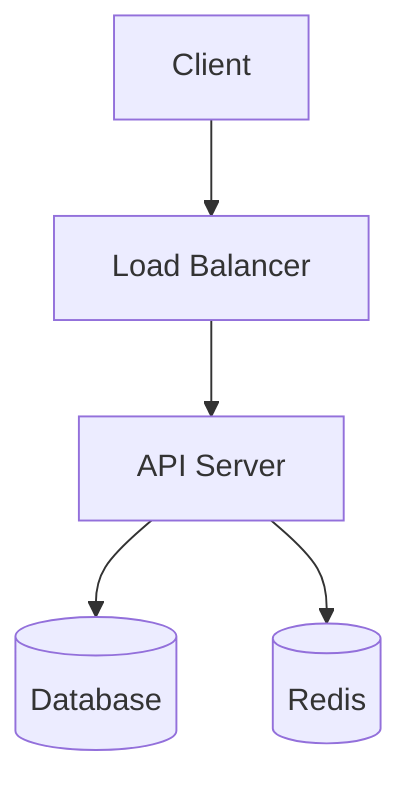

<h1 align="center">🖋 SongChaeYoung.dev</h1>
<p align="center"> 
<br/><br/>
기획부터 배포까지, 개발의 모든 흔적
<br/><br/>
</p>

<div align="center">  
<a href="https://gohugo.io/"></a><a href="https://github.com/adityatelange/hugo-PaperMod"></a><a href="https://songchaeyoung98.github.io"></a><a href="LICENSE"></a>
</div>

<br/>

<div align="center">  
🌐 <a href="https://songchaeyoung98.github.io">블로그 바로가기</a> ·
📝 <a href="#-새-글-작성하기">새 글 쓰기</a> ·
🐛 <a href="#-트러블슈팅">트러블슈팅</a>
</div>

---

## 📁 프로젝트 구조

```
SongChaeYoung98.github.io/
│
├── 📂 .github/
│   └── workflows/
│       └── deploy.yml          # GitHub Actions 자동 배포
│
├── 📂 assets/
│   └── css/
│       └── extended/
│           └── custom.css      # 커스텀 테마 (다크/라이트 모드)
│
├── 📂 content/
│   └── posts/                  # 블로그 포스트 (.md 파일)
│
├── 📂 layouts/
│   └── index.html              # 홈 페이지 커스텀 레이아웃
│
├── 📂 static/                  # 정적 파일 (이미지, favicon 등)
├── 📂 themes/
│   └── PaperMod/               # Hugo 테마 (git submodule)
│
└── hugo.toml                   # Hugo 전체 설정
```

---

## 🚀 로컬 개발 환경

### 필수 설치

| 도구 | 버전 | 설치 |
|------|------|------|
| Hugo Extended | 0.146.0+ | [다운로드](https://github.com/gohugoio/hugo/releases) |
| Git | 최신 | [다운로드](https://git-scm.com/) |
| Obsidian | 최신 | [다운로드](https://obsidian.md/) |

### 로컬 서버 실행

```bash
# 저장소 클론 (처음 한 번만)
git clone --recurse-submodules https://github.com/SongChaeYoung98/SongChaeYoung98.github.io.git
cd SongChaeYoung98.github.io

# 로컬 서버 시작 (draft 포함)
hugo server -D

# 브라우저에서 확인
# → http://localhost:1313
```

> `-D` 플래그는 `draft: true` 인 글도 미리보기로 보여줍니다. 실제 배포에는 포함되지 않아요.

---

## ✍️ 새 글 작성하기

### 포스트 타입 3가지

| 타입 | 용도 | 배지 색상 |
|------|------|-----------|
| `project` | 프로젝트 전체 기획 · 설계 · 회고 | 보라 |
| `devlog` | 커밋 단위 개발 로그 · 문제 해결 | 초록 |
| `architecture` | 시스템 설계 · 아키텍처 결정 기록 | 주황 |

### 파일명 규칙

```
YYYY-MM-DD-{type}-{title-kebab-case}.md

예시)
2025-03-15-project-realtime-chat.md
2025-03-10-devlog-jwt-silent-refresh.md
2025-03-02-architecture-msa-migration.md
```

### Front Matter 필수 항목

```yaml
---
title: "포스트 제목"
date: 2025-03-15
lastmod: 2025-03-15
draft: false              # 🔥 발행하려면 반드시 false
description: "한 줄 요약 (카드에 표시됨)"
categories: ["project"]  # project | devlog | architecture
tags: ["Go", "WebSocket", "Redis"]
series: "프로젝트명"      # devlog 시리즈 묶을 때 사용
showToc: true
commits: 47               # 커밋 수 (홈 통계에 반영)
---
```

> ⚠️ `draft: true` 상태로 push하면 배포된 블로그에 글이 보이지 않습니다.

### Obsidian에서 새 글 만들기

1. `content/posts/` 폴더에서 새 파일 생성
2. Templater 팝업에서 타입 선택 → 템플릿 자동 삽입
3. 내용 작성 후 `draft: false` 로 변경
4. 저장 → Obsidian Git이 자동 commit & push

---

## 📦 배포 방법

### 자동 배포 (권장)

```bash
git add .
git commit -m "feat: 포스트 제목

- 작업 내용 요약

📁 Files updated:
- content/posts/파일명.md

🕒 YYYY-MM-DD HH:MM"

git push origin main
# → GitHub Actions가 자동으로 빌드 & 배포 (약 1~2분 소요)
```

### 배포 확인

1. GitHub 레포 → **Actions 탭** → 워크플로우 진행 상황 확인
2. ✅ 초록 체크 뜨면 [블로그](https://songchaeyoung98.github.io) 확인

### 배포 구조

```
git push (main)
    ↓
GitHub Actions (deploy.yml)
    ↓
Hugo v0.146.0 Extended 빌드
    ↓
GitHub Pages 배포
    ↓
https://songchaeyoung98.github.io
```

---

## 🎨 테마 & 커스텀

### 다크 / 라이트 모드

- 기본값: **다크 모드**
- 헤더 우측 🌙 버튼으로 토글
- `hugo.toml` 에서 기본값 변경 가능:

```toml
[params]
  defaultTheme = "dark"   # dark | light | auto
```

`auto` 설정 시 OS 테마를 자동으로 따라갑니다.

### 커스텀 CSS 수정

`assets/css/extended/custom.css` 파일을 편집하면 됩니다.
PaperMod는 이 경로의 CSS를 자동으로 불러와요.

주요 색상 변수:

```css
:root {
  --accent:       #7c6af7;   /* 보라 — 메인 포인트 컬러 */
  --accent-green: #5de8c1;   /* 민트 — devlog 배지 */
  --accent-amber: #f4a942;   /* 주황 — architecture 배지 */
}
```

### 홈 레이아웃 수정

`layouts/index.html` 파일을 직접 편집합니다.
Hero 문구, 필터 버튼 이름, 통계 항목 등을 바꿀 수 있어요.

---

## 📝 Obsidian 세팅

### 권장 플러그인

| 플러그인 | 용도 | 필수 여부 |
|----------|------|-----------|
| **Templater** | 새 파일 생성 시 템플릿 자동 삽입 | ✅ 필수 |
| **Obsidian Git** | 저장 시 자동 commit & push | ✅ 필수 |
| **Dataview** | 포스트 목록 대시보드 | 권장 |
| **Excalidraw** | 아키텍처 다이어그램 작성 | 권장 |

### Templater 설정

```
Settings → Templater
  ├── Template folder location: templates
  ├── Trigger Templater on new file creation: ON
  ├── Enable Folder Templates: ON
  └── Folder Templates:
        content/posts → templates/new-post
```

### Obsidian Git 설정

```
Settings → Obsidian Git
  ├── Auto pull interval: 10 (분)
  ├── Auto push interval: 0 (수동 push 권장)
  └── Commit message: docs: update posts {{date}}
```

### Dataview 포스트 대시보드

Obsidian 내에서 아래 코드블록으로 포스트 목록을 볼 수 있어요:

```dataview
TABLE date, categories, tags
FROM "content/posts"
WHERE draft = false
SORT date DESC
```

---

## 📐 Mermaid 다이어그램

포스트 내에서 바로 사용 가능합니다:

````markdown

````

---

## 🔧 트러블슈팅

### 배포했는데 블로그에 글이 안 보여요

```yaml
# 원인: draft가 true 상태
draft: true   # ← 이걸
draft: false  # ← 이렇게 바꾸고 다시 push
```

### GitHub Actions 빌드가 실패해요

| 에러 메시지 | 원인 | 해결 |
|-------------|------|------|
| `Min 0.146.0 required` | Hugo 버전 낮음 | `deploy.yml` 에서 `HUGO_VERSION: 0.146.0` 으로 수정 |
| `paginate was deprecated` | 구버전 설정 키 | `hugo.toml` 에서 `paginate` → `[pagination] pagerSize` 로 변경 |
| `google_analytics.html not found` | analytics 설정 누락 | `hugo.toml` 에서 analytics 관련 설정 제거 |
| `pages source not set` | Pages 소스 설정 오류 | GitHub Settings → Pages → Source: **GitHub Actions** 로 변경 |

### CSS가 적용이 안 돼요

```
assets/css/extended/custom.css  ← 경로가 정확한지 확인
```

`extended` 폴더가 없으면 직접 만들어야 해요. PaperMod는 이 경로만 자동으로 불러옵니다.

### 다크모드 색상이 안 나와요

PaperMod는 `data-theme="dark"` 방식을 사용합니다.
CSS에서 `.dark { }` 가 아닌 반드시 `[data-theme="dark"] { }` 로 작성해야 해요.

### 테마 서브모듈이 비어있어요

```bash
git submodule update --init --recursive
```

---

## ⚙️ hugo.toml 주요 설정 참고

```toml
[params]
  defaultTheme = "dark"        # 기본 테마: dark | light | auto
  ShowReadingTime = true       # 읽기 시간 표시
  ShowCodeCopyButtons = true   # 코드 복사 버튼
  ShowBreadCrumbs = true       # 브레드크럼 네비게이션
  showtoc = true               # 목차 표시
  tocopen = false              # 목차 기본 접힘

[markup.highlight]
  style = "base16-snazzy"      # 코드 하이라이트 테마
```

> 코드 하이라이트 테마 목록: [https://xyproto.github.io/splash/docs/](https://xyproto.github.io/splash/docs/)

---

## 📚 참고 링크

- [Hugo 공식 문서](https://gohugo.io/documentation/)
- [PaperMod 위키](https://github.com/adityatelange/hugo-PaperMod/wiki)
- [Hugo 마크다운 가이드](https://gohugo.io/content-management/formats/)
- [Mermaid 다이어그램 문법](https://mermaid.js.org/intro/)
- [GitHub Pages 설정 가이드](https://docs.github.com/en/pages)

---

<div align="center">
Made with ☕ · Powered by 
<a href="https://gohugo.io/">Hugo</a> & 
<a href="https://github.com/adityatelange/hugo-PaperMod">PaperMod</a>
</div>
