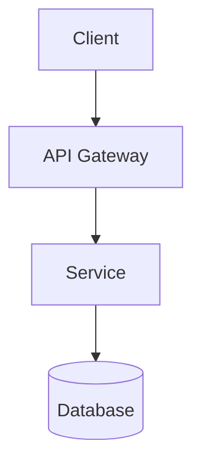

# SongChaeYoung.dev — 블로그 세팅 가이드

## 📁 파일 적용 위치

```
SongChaeYoung98.github.io/
├── hugo.toml                          ← 1. hugo.toml 교체
├── assets/
│   └── css/
│       └── extended/
│           └── custom.css             ← 2. 폴더 생성 후 복사
├── .github/
│   └── workflows/
│       └── deploy.yml                 ← 3. 이미 있으면 교체
└── templates/                         ← 4. Obsidian vault 루트에 위치
    ├── project-post.md
    ├── devlog-post.md
    ├── architecture-post.md
    └── new-post.md
```

---

## 🚀 빠른 세팅 순서

### 1. hugo.toml 교체
기존 `hugo.toml`을 제공된 파일로 교체합니다.
`baseURL`을 본인 주소로 확인하세요.

### 2. 커스텀 CSS 적용
PaperMod는 `assets/css/extended/` 폴더의 CSS를 자동으로 불러옵니다.
폴더가 없으면 직접 만들어주세요:
```bash
mkdir -p assets/css/extended
cp custom.css assets/css/extended/custom.css
```

### 3. Obsidian 플러그인 설치
Community Plugins에서 다음을 설치:
- **Templater** — 동적 템플릿 (날짜 자동 입력)
- **Obsidian Git** — 저장 시 자동 commit/push
- **Dataview** — 포스트 목록 대시보드

### 4. Templater 설정
Settings → Templater:
- Template folder location: `templates`
- Trigger on new file creation: ON
- Folder templates: `content/posts` → `templates/new-post`

### 5. Obsidian Git 설정
Settings → Obsidian Git:
- Auto pull interval: `10` (분)
- Commit message: `docs: update posts {{date}}`

---

## ✍️ 글 쓰는 방법

### 새 포스트 작성
1. `content/posts/` 폴더에서 새 파일 생성
2. Templater가 자동으로 타입 선택 팝업 표시
3. `project` / `devlog` / `architecture` 중 선택
4. 제목 입력 → 템플릿 자동 삽입

### 포스트 타입별 파일명 규칙
```
2025-03-15-project-realtime-chat.md
2025-03-10-devlog-jwt-silent-refresh.md
2025-03-02-architecture-msa-migration.md
```

### Front Matter 필수 항목
```yaml
---
title: "포스트 제목"
date: 2025-03-15
draft: false        # 발행 시 false로 변경
categories: ["project"]   # project | devlog | architecture
tags: ["Go", "WebSocket"]
series: "프로젝트명"  # devlog에서 사용
---
```

---

## 🏷 카테고리 & 태그 전략

| 카테고리 | 용도 | 예시 |
|----------|------|------|
| `project` | 프로젝트 전체 정리 | 실시간 채팅 서비스 |
| `devlog` | 커밋 단위 개발 로그 | [#23] JWT 만료 처리 |
| `architecture` | 시스템 설계 기록 | MSA 전환기 |

**태그**: 기술 스택 위주 (`Go`, `Spring Boot`, `Redis`, `k8s` 등)

---

## 🔧 로컬 개발

```bash
# 서버 시작
hugo server -D

# 빌드
hugo --minify

# 새 포스트 (hugo 명령어 방식)
hugo new posts/2025-03-15-project-my-service.md
```

---

## 🌙 다크/라이트 모드

- 기본값: **다크 모드**
- 헤더 우측 토글 버튼으로 전환
- `hugo.toml`에서 기본값 변경:
  ```toml
  defaultTheme = "dark"   # dark | light | auto
  ```
- `auto`로 설정 시 OS 설정을 따라감

---

## 📝 Mermaid 다이어그램

포스트 내에서 바로 사용 가능:
```markdown

```

---

## 🐛 자주 겪는 문제

| 문제 | 원인 | 해결 |
|------|------|------|
| CSS 적용 안 됨 | 폴더 경로 오류 | `assets/css/extended/` 확인 |
| 테마 토글 없음 | `disableThemeToggle = true` | hugo.toml에서 false로 |
| 포스트 안 보임 | `draft = true` | false로 변경 후 빌드 |
| 빌드 오류 | Hugo 버전 낮음 | Hugo Extended 0.120+ 사용 |
