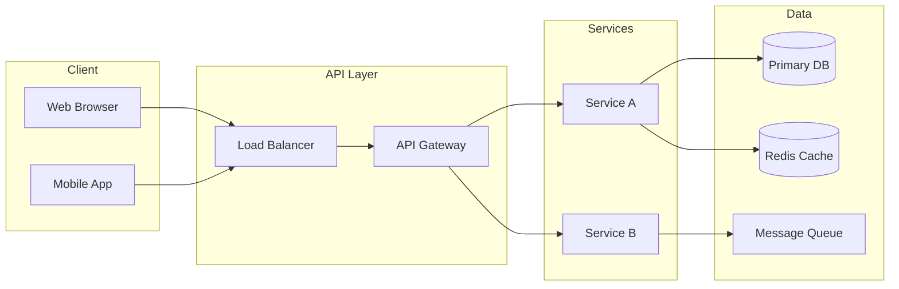
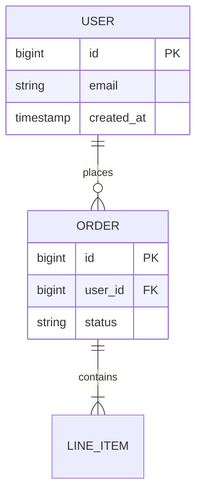

## 📐 설계 배경

### 해결해야 할 요구사항
- 기능 요구: 
- 비기능 요구 (성능, 가용성, 확장성):
  - TPS: 최대 `N req/s`
  - 응답시간: `< Xms`
  - 가용성: `99.X%`

### 설계 범위 정의
<!-- 무엇을 포함하고 무엇을 제외할 것인지 명확히 -->

**In Scope**
- 

**Out of Scope**
- 

---

## 🗺 전체 아키텍처



---

## 🔧 컴포넌트별 설계 결정

### [컴포넌트 1명]

**역할**: 

**선택지 비교**

| 옵션 | 장점 | 단점 | 비고 |
|------|------|------|------|
| 옵션 A | | | |
| 옵션 B | | | |

**결정**: 옵션 A — 이유:

---

### [컴포넌트 2명]

**역할**:

**설계 포인트**:
```
// 주요 설정 또는 코드
```

---

## 📊 데이터 모델

### 핵심 엔티티 관계



### 읽기/쓰기 패턴 분석
- **Write Heavy**: 
- **Read Heavy**: 
- **캐싱 전략**: 

---

## ⚡ 성능 설계

### 병목 지점 예측
1. 
2. 

### 최적화 전략

| 구간 | 문제 | 해결책 |
|------|------|--------|
| DB | N+1 쿼리 | Fetch Join / Batch |
| API | 응답 지연 | Redis Cache |
| 네트워크 | 대용량 전송 | CDN / Compression |

---

## 🔒 장애 대응 설계

### 장애 시나리오

| 장애 | 영향도 | 대응 |
|------|--------|------|
| DB 다운 | 높음 | Read Replica 페일오버 |
| 캐시 장애 | 중간 | Cache Aside 패턴 |

### Circuit Breaker 설정
```yaml
# 예시
resilience4j:
  circuitbreaker:
    instances:
      serviceA:
        failureRateThreshold: 50
        waitDurationInOpenState: 30s
```

---

## 📈 확장 계획

### 현재 → 목표 트래픽
- 현재: `X req/s`
- 6개월 후: `Y req/s`

### 수평 확장 포인트
- [ ] Service A — stateless, 바로 scale-out 가능
- [ ] DB — Read Replica 추가
- [ ] 메시지 큐 — 파티션 증설

---

## 💭 설계 후기

### 잘 된 결정
- 

### 다음에 다르게 할 것
- 

### 참고 자료
- []()
