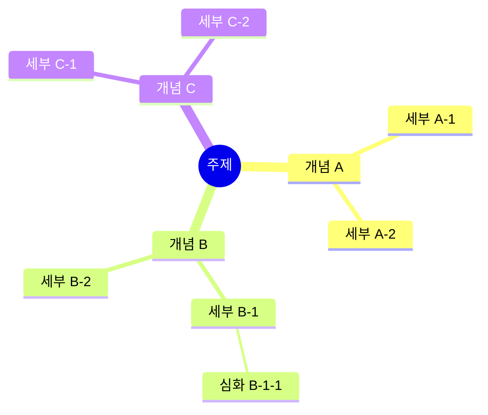
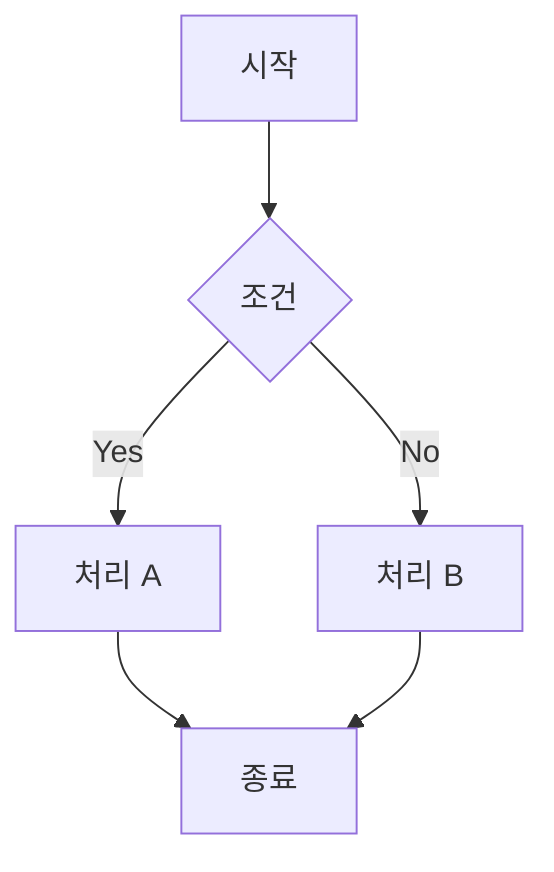
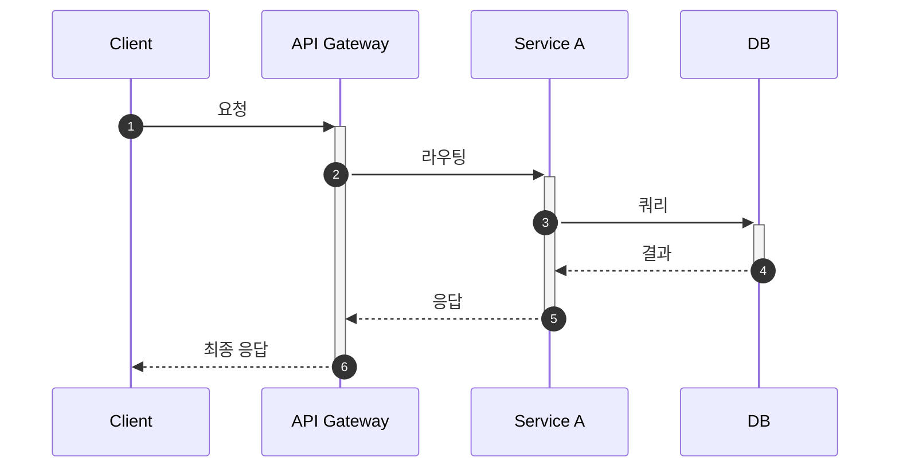
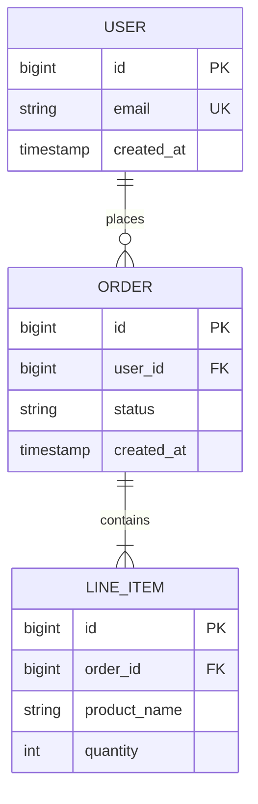
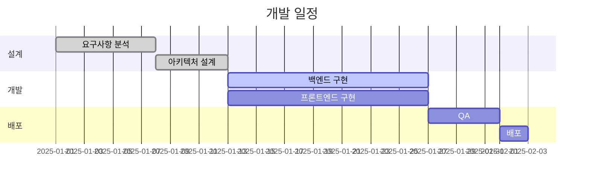

## 🗺 개념 구조도

<!-- Hugo에서 Mermaid mindmap을 렌더링합니다.
     hugo.toml에 markup.goldmark.renderer.unsafe = true 가 설정돼 있어야 합니다. -->

---

## 📐 시스템 흐름도

---

## 🔄 시퀀스 다이어그램

---

## 🧩 ER 다이어그램

---

## 📊 Gantt (개발 일정)

---

## 📝 설명

<!-- 다이어그램에 대한 부연 설명 -->
