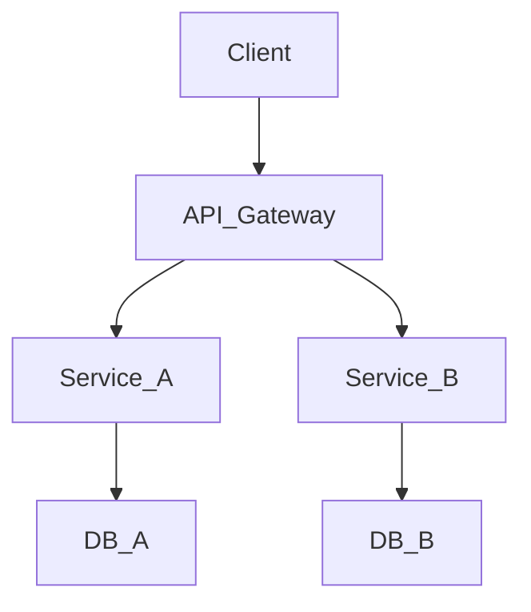

## 📌 프로젝트 개요

| 항목 | 내용 |
|------|------|
| 프로젝트명 | |
| 기간 | |
| 역할 | |
| 레포 | [GitHub](#) |
| 배포 | [링크](#) |

> 한 줄 요약: 이 프로젝트가 해결하는 문제는 무엇인가.

---

## 🎯 기획 배경

### 문제 정의
<!-- 왜 이 서비스가 필요한가? 어떤 페인 포인트를 해결하는가? -->

### 목표
- [ ] 
- [ ] 

---

## 🏗 시스템 설계

### 기술 스택

| 레이어 | 기술 | 선택 이유 |
|--------|------|-----------|
| Backend | | |
| Database | | |
| Infra | | |
| 기타 | | |

### 아키텍처 다이어그램
<!-- Obsidian Excalidraw 또는 Mermaid 다이어그램 삽입 -->



### DB 스키마 (핵심 테이블)
```sql
-- 핵심 엔티티만 기록
CREATE TABLE example (
  id BIGINT PRIMARY KEY AUTO_INCREMENT,
  created_at TIMESTAMP DEFAULT NOW()
);
```

---

## ⚙️ 핵심 구현 포인트

### [구현 포인트 1]
<!-- 설계 결정 사항과 이유를 기록 -->

**고려한 옵션**
- Option A: 장점 / 단점
- Option B: 장점 / 단점

**결정**: Option A 선택 — 이유:

### [구현 포인트 2]

---

## 🔄 개발 흐름 (커밋 단위)

| 커밋 | 내용 | 비고 |
|------|------|------|
| `feat: 기능명` | | |
| `fix: 버그명` | | |
| `refactor: 대상` | | |

---

## 🧪 테스트 & 검증

### 테스트 전략
- Unit: 
- Integration: 
- Load: 

### 결과
<!-- 성능 수치, 테스트 커버리지 등 -->

---

## 🚀 배포 & 운영

### 배포 파이프라인
```
push → GitHub Actions → Docker Build → ECR → ECS (or k8s)
```

### 모니터링
- 로그: 
- 알림: 

---

## 💭 회고

### 잘 된 점
- 

### 개선할 점
- 

### 다음에 적용할 것
- 
